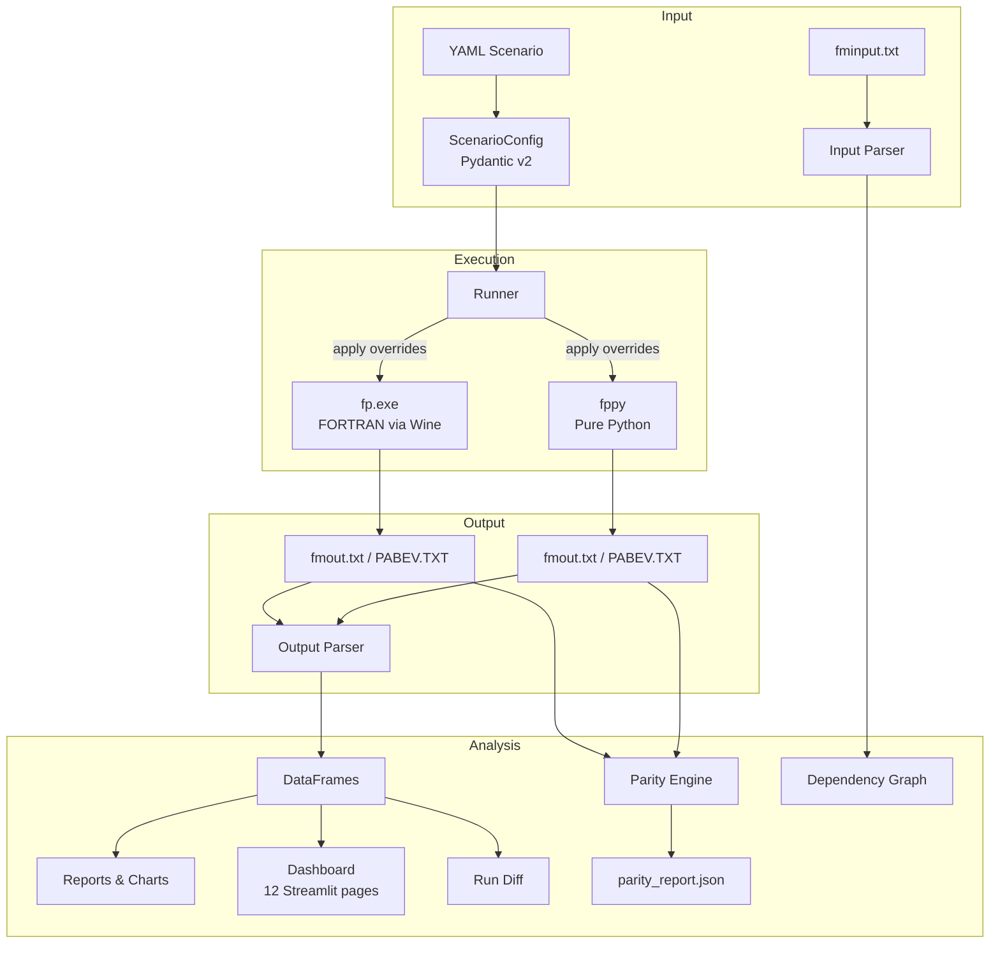
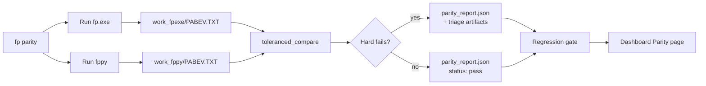

# Architecture

## Data flow



## Parity validation flow



## Module layout

```
src/fp_wraptr/
  __init__.py           # Package root, version
  cli.py                # Typer CLI entry point
  io/
    parser.py           # FP output parser (fmout.txt -> FPOutputData)
    input_parser.py     # FP input parser (fminput.txt -> dict)
    writer.py           # Write FP-format files from Python objects
    loadformat.py       # LOADFORMAT output handling
    fmdata_writer.py    # fmdata.txt writer
    fmdata_diff.py      # fmdata.txt comparison
  runtime/
    backend.py          # Backend interface
    fp_exe.py           # Subprocess wrapper for fp.exe
    fairpy.py           # Subprocess wrapper for fppy (pure-Python backend)
    solve_errors.py     # Solve error classification
  scenarios/
    config.py           # Pydantic scenario config models
    runner.py           # Scenario execution pipeline
    batch.py            # Multi-scenario batch execution
    bundle.py           # Bundle management
    catalog.py          # Catalog entries
    packs.py            # Pack discovery
    dsl.py              # Scenario DSL compiler
    authoring/          # Managed workspace authoring
    policies.py         # Policy/override templates
  analysis/
    diff.py             # Run comparison and summary deltas
    parity.py           # Dual-engine PABEV-based parity
    parity_regression.py# Golden baseline save/compare
    triage_fppy.py      # fppy report bucketing
    triage_parity_hardfails.py  # Hard-fail recomputation
    report.py           # Markdown report generation
    graph.py            # Dependency graph (networkx)
    sensitivity.py      # Sensitivity analysis
    historical_fit.py   # Historical vs forecast fit
    scoreboard.py       # Run scoring
  data/
    update_fred.py      # FRED data integration
    fair_bundle.py      # Official Fair bundle handling
    dictionary.py       # Variable dictionary
    source_map.py       # Data source tracking
  fred/                 # FRED API client
  bea/                  # BEA API client
  bls/                  # BLS API client
  viz/
    plots.py            # Matplotlib forecast charts
  dashboard/
    artifacts.py        # Artifact scanning and metadata
    charts.py           # Plotly dashboard charts
    scenario_tools.py   # Scenario manipulation helpers
    ptcoef_editor.py    # Coefficient editor UI
  mcp_server.py         # FastMCP server (44 tools, 9 resources)
  pages_export.py       # GitHub Pages static export
```

## Key design decisions

### Subprocess-first for fp.exe

We call `fp.exe` as a subprocess rather than compiling Fortran into a Python extension. This is simpler, more portable (any platform that can run the binary), and avoids complex build tooling. The tradeoff is requiring Wine on macOS/Linux.

### Dual engines with parity contract

Both `fp.exe` (FORTRAN) and `fppy` (pure Python) emit a common `PABEV.TXT` output. The parity engine compares these cell-by-cell with hard-fail invariants (missing values, discrete jumps, sign flips) and toleranced numeric diffs. This lets us validate fppy against the battle-tested original.

### Pydantic for config

Scenario configs use Pydantic v2 models for validation, serialization, and type safety. YAML is the user-facing format.

### Copy-and-patch for input overrides

The initial approach to scenario overrides is simple text-level patching of `fminput.txt`. A future AST-level manipulation layer will replace this once the input parser is complete.

### Canonical parser contract

`parse_fp_input_text` emits normalized, lower-case dictionary keys (for commands and parameters) and removes ambiguous alias duplication so consumers can rely on one canonical shape.

### Optional extras

Heavy dependencies (matplotlib, streamlit, fastmcp, networkx) are optional extras to keep the core package lightweight. Install what you need:

```bash
uv sync                       # core only
uv sync --all-extras          # everything
pip install fp-wraptr[dashboard,mcp]  # specific extras
```

## FP file format reference

See `llms.txt` at the repo root for a concise format summary.

### fminput.txt
Custom DSL with commands: `SPACE`, `SETUPSOLVE`, `LOADDATA`, `SMPL`, `CREATE`, `GENR`, `EQ`, `IDENT`, `SOLVE`, `CHANGEVAR`, `PRINTVAR`, etc. Comments start with `@`.

### fmdata.txt
FORTRAN-format time series: `SMPL <start> <end>; LOAD <varname>;` followed by scientific notation floats in fixed-width columns.

### fmout.txt
Program output log containing:

1. Echo of input commands with program responses
2. Estimation results (coefficients, R-squared, etc.)
3. Solve iteration log
4. Forecast table: variable ID, name, level/change/pct-change rows

### fmexog.txt
Exogenous variable assumptions: `CHANGEVAR;` blocks with `<VARNAME> <METHOD>` and values. Methods: `CHGSAMEPCT`, `SAMEVALUE`, `CHGSAMEABS`.
