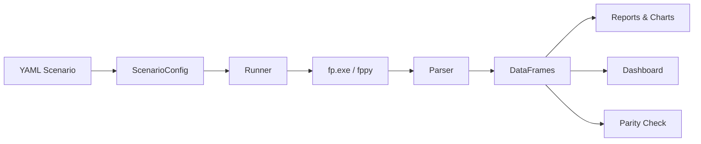

# fp-wraptr

<div style="text-align: center; margin: 0.5rem 0;">
  
</div>

**Python toolkit to modernize the Fair-Parke macroeconomic model workflow.**

fp-wraptr wraps [Ray Fair's US Macroeconometric Model](https://fairmodel.econ.yale.edu/), making it easier to run scenarios, inspect results, compare forecasts, and build on decades of economic modeling work — all from Python.

It reads the standard Fair Model files (`fminput.txt`, `fmdata.txt`, `fmexog.txt`, `fmout.txt`) directly, so you can use your existing model data as-is. On top of that, fp-wraptr adds YAML scenario configs, a compact DSL, and an MCP server for LLM-assisted authoring.

It supports three solver paths: the original `fp.exe`, the pure-Python `fppy` engine, and a bundle-backed R solver via `fp-r`.

<div style="text-align: center; margin: 1rem 0 1.5rem;">
  <a class="md-button" href="https://smkwray.github.io/fp-wraptr/model-runs/">Model Runs Explorer</a>
  <a class="md-button md-button--primary" href="https://github.com/smkwray/fp-wraptr">View on GitHub</a>
</div>

!!! tip "New to the Fair-Parke model?"
    The FP model is a large-scale macroeconometric model of the US economy maintained by Ray Fair at Yale University. It contains 130+ equations covering output, employment, prices, interest rates, and government accounts. fp-wraptr lets you drive this model from modern tooling instead of hand-editing FORTRAN-era input files.

## What can you do?

- **Run forecasts** — Define scenarios in YAML, execute with `fp run`, get structured output in pandas DataFrames
- **Compare scenarios** — Diff two runs side-by-side, identify top-moving variables, export deltas to CSV
- **Update data from FRED** — Pull the latest economic data from FRED, BEA, and BLS directly into the model
- **Explore equations** — Build dependency graphs, trace how variables flow through 130+ equations
- **Validate with parity** — Run `fp.exe` and `fppy` head-to-head by default, or select an explicit parity pair such as `fpexe` vs `fp-r`
- **Use AI agents** — An MCP server with 44 tools lets LLMs author scenarios, run models, and interpret results

## Getting started

```bash
git clone https://github.com/smkwray/fp-wraptr.git
cd fp-wraptr
scripts/uvsync --all-extras
```

Then follow the [Quickstart guide](quickstart.md) to configure your model files and run your first scenario.

## Meet the mascots

| | Name | Role |
|---|---|---|
|  | **Rex** (Velociraptor) | `fp.exe` — the original FORTRAN engine |
|  | **Archie** (Archaeopteryx) | `fppy` — the pure-Python solver |
|  | **Raptr** (Eagle) | Agentic features — MCP server, packs, and workspace authoring |

Archie still covers the Python route. fp-wraptr now includes an R route too via `fp-r`.

## Architecture at a glance



## Features

- **Scenario configs** — Define runs in YAML with Pydantic validation
- **IO parsing** — Read FP outputs into pandas DataFrames with canonical keys
- **Batch runner** — Execute multiple scenarios and compare against golden baselines
- **Dependency graph** — Trace upstream/downstream variable dependencies with networkx
- **Report generation** — Markdown run reports and comparison summaries
- **Visualization** — Matplotlib charts and a 12-page Streamlit dashboard with Plotly
- **MCP server** — 44 tools for LLM-assisted exploration and scenario authoring
- **Managed workspaces** — reusable scenario packs and templates for LLM-driven or manual authoring
- **Three solver paths** — Run the FORTRAN engine, the pure-Python solver, or the bundle-backed R solver
- **Data pipelines** — FRED, BEA, and BLS data integration with safe-lane update workflows

## Documentation

<div class="grid cards" markdown>

-   **[Quickstart](quickstart.md)**

    Set up your environment and run your first scenario

-   **[Architecture](architecture.md)**

    Module layout, data flow, and design decisions

-   **[Scenarios](scenarios.md)**

    YAML configuration reference with examples

-   **[CLI Reference](cli.md)**

    Complete command reference for 70+ CLI commands

-   **[Dashboard](dashboard.md)**

    12-page Streamlit dashboard guide

-   **[Agent Workflows](agent-workflows.md)**

    LLM-assisted scenario design with managed workspaces

-   **[Parity](parity.md)**

    Operator playbook for dual-engine validation

-   **[Data Update](data-update.md)**

    FRED/BEA/BLS data refresh workflows

-   **[Model Runs Explorer](https://smkwray.github.io/fp-wraptr/model-runs/)**

    Browse exported forecasts and share results with your team

</div>
